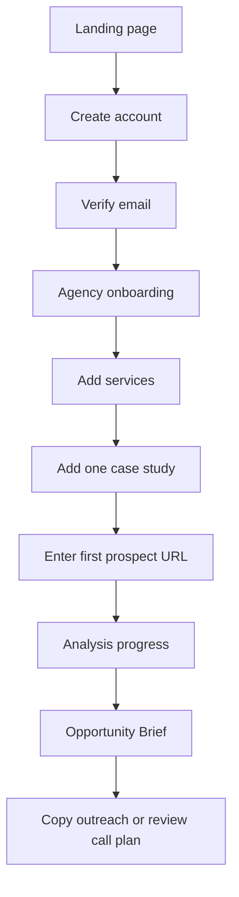
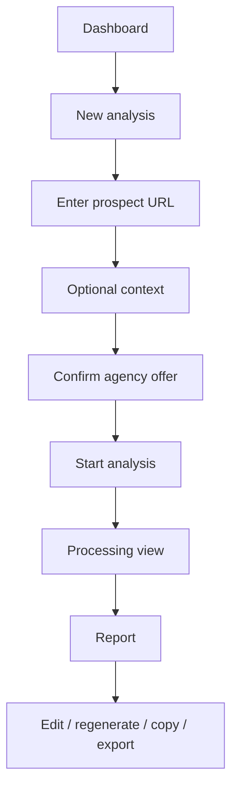
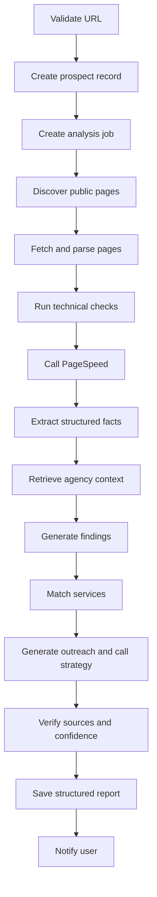
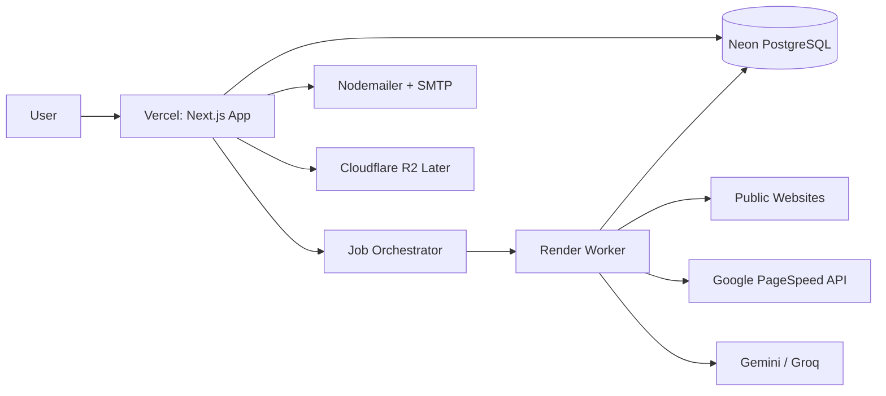

# LeadLens — Product Requirements Document (PRD)

**Product:** LeadLens  
**Product type:** AI-powered prospect intelligence and pre-sales preparation SaaS  
**Primary market:** Small web development, web design, CRO, e-commerce, and automation agencies  
**Document version:** 1.0  
**Status:** Product definition for zero-fund validation and MVP development  
**Primary deployment target:** Vercel + Render  
**Primary database:** Neon PostgreSQL  

---

## 1. Executive Summary

LeadLens helps small digital agencies understand a prospect before sending the first message.

A user enters a prospect's website, optionally adds a specific company or contact context, and LeadLens analyzes the prospect's public online presence. It then matches identified problems and opportunities with the agency's own services, case studies, positioning, and ideal customer profile.

The result is a source-backed **Opportunity Brief** containing:

- Prospect summary
- Website and business observations
- Technical and conversion issues
- Fit score and confidence score
- Recommended service offer
- Suggested project angle
- Relevant agency case study
- Personalized outreach copy
- Discovery-call questions
- Objection-handling notes
- Proposal outline
- Sources, dates, and confidence indicators

LeadLens is not intended to become a complete CRM in the first stages. Its initial purpose is to become the intelligence layer between discovering a prospect and contacting that prospect.

The first product promise is:

> **Turn any business website into a qualified sales opportunity.**

The long-term product vision is:

> **A prospect-to-client intelligence system for service agencies that knows what the prospect needs, what the agency can deliver, and what the salesperson should do next.**

---

## 2. Product Vision

### 2.1 Vision statement

LeadLens will help small agencies compete with larger sales teams by giving every founder, account executive, and business-development representative a repeatable pre-sales research process.

The product should feel like an elite sales strategist, technical analyst, and agency consultant working together.

### 2.2 Product philosophy

LeadLens should not produce generic AI summaries.

Every report must connect two sides:

1. **The prospect side**
   - Business model
   - Current website
   - Public reputation
   - Technical condition
   - Conversion weaknesses
   - Growth signals
   - Possible buying triggers
   - Risks and constraints

2. **The agency side**
   - Services
   - Expertise
   - Industries served
   - Case studies
   - Pricing bands
   - Delivery capacity
   - Preferred project types
   - Ideal customer profile
   - Brand voice

The product's strongest value comes from matching these two sides and producing a practical recommendation.

### 2.3 Product principles

1. **Action over information**  
   Every important insight should lead to a recommended next action.

2. **Evidence over invention**  
   Factual claims should include source references. Inferences must be labeled as inferences.

3. **Focused intelligence over data overload**  
   The report should prioritize useful findings instead of presenting every available data point.

4. **Agency-specific output**  
   The same prospect should produce different recommendations for different agencies.

5. **Fast perceived progress**  
   Users should see visible analysis stages instead of waiting on a blank screen.

6. **Human control**  
   Users must be able to edit, reject, regenerate, copy, and export AI output.

7. **Trust by design**  
   Confidence labels, timestamps, sources, and limitations must be visible.

8. **Responsive by default**  
   Every feature must remain usable on desktop, tablet, and mobile.

9. **Premium without unnecessary complexity**  
   The interface should feel world-class while keeping the workflow simple.

10. **Validation before scale**  
    Features should be added only after evidence shows users need them.

---

## 3. Problem Definition

### 3.1 Primary problem

Small web and digital agencies often have strong delivery capabilities but weak, inconsistent, and founder-dependent sales processes.

Before contacting a prospect, an agency may need to:

- Review the prospect's website
- Understand the company
- Identify business problems
- Check the website's performance
- Find outdated technology
- Look for conversion weaknesses
- Compare the prospect with competitors
- Decide what service to pitch
- Select a relevant case study
- Write personalized outreach
- Prepare discovery questions
- Build an initial proposal angle

This process is frequently performed manually across many tools and browser tabs. It can take 20–60 minutes per prospect and is often skipped because the agency is busy delivering client work.

### 3.2 Secondary problems

- Generic AI tools do not know the agency's actual services or delivery strengths.
- Prospecting platforms often prioritize contact data rather than agency-specific opportunity analysis.
- Reports can contain unsupported or incorrect statements.
- Founders repeatedly recreate the same research and outreach workflow.
- Junior sales staff may not know what technical or commercial signals matter.
- Agencies often contact low-fit leads because qualification is inconsistent.
- The connection between a prospect problem and a sellable agency service is not obvious.
- Existing tools may be too expensive or too complex for small agencies.
- Useful insights are scattered across notes, chats, documents, and spreadsheets.

### 3.3 User pain statements

Typical user thoughts include:

- “I know this company may need a new website, but I need stronger evidence.”
- “I spend too much time researching leads that never respond.”
- “My outreach sounds generic.”
- “I do not know which case study to show this prospect.”
- “I want my sales assistant to prepare prospects the way I would.”
- “I need a faster way to decide whether this lead is worth contacting.”
- “I want to enter a URL and know what to pitch.”

### 3.4 Why current alternatives are insufficient

| Alternative | Strength | Limitation for LeadLens users |
|---|---|---|
| ChatGPT or Gemini manually | Flexible and inexpensive | Requires repeated prompting, manual source collection, and agency context |
| Website audit tools | Strong technical checks | Usually do not connect findings to agency sales strategy |
| CRM platforms | Organize pipeline | Do not deeply analyze prospect websites |
| Data enrichment tools | Provide company/contact data | May not explain what service the prospect should buy |
| Spreadsheets and Notion | Flexible | Manual, inconsistent, and difficult to standardize |
| Human research assistant | High quality when trained | Expensive and difficult to scale |
| Generic proposal tools | Produce documents | Usually begin after the opportunity has already been understood |

---

## 4. Target Market

### 4.1 Initial target segment

LeadLens will initially target:

> Owner-led web development, web design, CRO, e-commerce, and automation agencies with 3–20 employees, typically selling projects worth $5,000–$30,000 to small and medium businesses.

### 4.2 Initial geographic focus

The product can technically serve agencies globally, but early validation should prioritize English-speaking agencies operating in:

- United States
- United Kingdom
- Canada
- Australia
- Europe with English-language sales processes

The product architecture must support internationalization later, but English-only is acceptable for the first validation release.

### 4.3 Primary buyer

- Agency founder
- Managing director
- Head of sales
- Business-development manager
- Account executive in a small agency

### 4.4 Primary user

- Founder doing outbound sales
- Sales representative
- Lead researcher
- Client strategist
- Account manager preparing for a call

### 4.5 Excluded early segments

LeadLens will not initially optimize for:

- Enterprise sales teams
- Recruitment agencies
- Real-estate brokerages
- Individual freelancers selling very low-cost services
- Large agencies with extensive enterprise CRM requirements
- Contact-list sellers
- Mass cold-email automation companies
- Users seeking unauthorized data scraping

---

## 5. User Personas

## 5.1 Persona A — Founder-Seller

**Name:** Alex  
**Agency size:** 6 people  
**Role:** Founder and technical lead  
**Typical project value:** $8,000–$20,000  
**Main challenge:** Sales work competes with project delivery.

**Behavior**

- Finds prospects through referrals, directories, LinkedIn, and local search
- Researches leads late at night or before calls
- Uses spreadsheets, ChatGPT, and email
- Has strong technical knowledge but limited sales process
- Wants quality rather than huge lead volume

**Needs**

- Fast prospect qualification
- Strong reasons for outreach
- Service recommendation
- Ready-to-edit email
- Technical evidence for a redesign pitch
- Relevant case-study suggestion

**Success moment**

Alex enters a website and receives a brief that is good enough to use in a real sales call without rewriting everything.

---

## 5.2 Persona B — Business Development Representative

**Name:** Maya  
**Agency size:** 15 people  
**Role:** Business-development representative  
**Typical project value:** $10,000–$40,000  
**Main challenge:** Does not fully understand technical website issues.

**Behavior**

- Handles 20–40 prospects per week
- Needs repeatable research
- Works from a CRM and task list
- Relies on technical colleagues for audit support
- Needs approval from the founder before sending strategic outreach

**Needs**

- Clear issue explanations
- Confidence indicators
- Business impact translation
- Suggested talking points
- Qualification score
- Standardized report format

**Success moment**

Maya can independently prepare a qualified opportunity without asking a developer to review every site.

---

## 5.3 Persona C — Agency Strategist

**Name:** Daniel  
**Agency size:** 12 people  
**Role:** Strategist and account manager  
**Typical project value:** $15,000–$50,000  
**Main challenge:** Discovery calls are inconsistent.

**Needs**

- Prospect context
- Competitor observations
- Discovery questions
- Hypothesis-based opportunity mapping
- Proposal structure
- Objection preparation

**Success moment**

Daniel enters a sales call with a credible hypothesis, relevant evidence, and a clear recommended offer.

---

## 6. Jobs to Be Done

### 6.1 Functional jobs

- Determine whether a prospect is worth pursuing.
- Understand a prospect's website and business quickly.
- Identify problems the agency can solve.
- Match those problems with agency services.
- Prepare personalized outreach.
- Prepare for a discovery call.
- Select a relevant case study.
- Build the starting point for a proposal.
- Save and revisit prospect intelligence.
- Share the report with team members.

### 6.2 Emotional jobs

- Feel confident before contacting a prospect.
- Avoid sounding generic or unprepared.
- Reduce uncertainty when selecting an offer.
- Feel that the agency has a professional sales system.
- Avoid wasting time on poor-fit opportunities.

### 6.3 Social jobs

- Appear knowledgeable to prospects.
- Demonstrate strategic thinking.
- Help junior staff perform like experienced sales strategists.
- Present a polished internal briefing to the team.

---

## 7. Goals and Non-Goals

## 7.1 Product goals

### MVP goals

1. A user can create an account and define an agency profile.
2. A user can submit a valid public website URL.
3. LeadLens can collect basic website and technical information.
4. LeadLens can produce a source-backed Opportunity Brief.
5. The brief can match prospect issues to agency services.
6. The user can edit and regenerate selected sections.
7. The user can save, revisit, duplicate, and delete reports.
8. The system can clearly show processing progress and failures.
9. The experience is fully usable on desktop, tablet, and mobile.
10. The product can be tested with real agencies at near-zero infrastructure cost.

### Business goals

- Validate whether agencies repeatedly use the product.
- Validate willingness to pay.
- Determine which report sections create the most value.
- Measure time saved per prospect.
- Learn whether the report improves response quality or call preparation.
- Identify the strongest agency sub-niche.

### UX goals

- A new user understands the value in under 10 seconds.
- The initial setup takes less than 10 minutes.
- Submitting a prospect takes less than 60 seconds.
- The user always understands what the system is doing.
- The report remains readable despite being information-dense.
- Mobile users can review, copy, and share insights comfortably.

## 7.2 Non-goals for the first release

- Full CRM replacement
- Automated mass outreach
- LinkedIn scraping
- Contact database
- Complex team permissions
- White-label client portals
- Native mobile applications
- Full proposal e-signature system
- Automated invoicing
- Client project management
- Slack replacement
- Notion replacement
- Custom machine-learning model training
- Enterprise SSO
- On-premise deployment
- Full multilingual report generation
- Automated browser interaction with protected websites

---

## 8. Positioning and Messaging

### 8.1 Category

AI prospect intelligence and pre-sales preparation for agencies.

### 8.2 Core positioning statement

> LeadLens analyzes a prospect's online presence, identifies business and website opportunities, matches them with your agency's services, and prepares personalized outreach and sales-call strategy.

### 8.3 Homepage headline options

Primary:

> **Turn any business website into a qualified sales opportunity.**

Alternatives:

- Know what to pitch before you reach out.
- See what every prospect needs.
- Research less. Pitch smarter.
- From website to winning pitch.
- Understand the opportunity before the first message.

### 8.4 Supporting message

> Enter a prospect's website and receive a source-backed opportunity brief, personalized outreach, discovery questions, and a recommended service angle based on your agency's capabilities.

### 8.5 Differentiator

> LeadLens does not only analyze the prospect. It understands what your agency can sell to that prospect.

---

## 9. Scope Overview

## 9.1 MVP scope

### Account and workspace

- Registration
- Login
- Logout
- Email verification
- Forgot password
- Reset password
- Session management
- Personal profile
- Agency workspace
- Single workspace per user in MVP
- Owner role only in earliest alpha
- Team-ready schema for future expansion

### Agency setup

- Agency name
- Website
- Logo URL or generated initials
- Short description
- Services
- Industries served
- Ideal customer profile
- Typical project range
- Geographic focus
- Brand voice
- Case studies
- Preferred outreach channels
- Excluded prospect types

### Prospect analysis

- URL validation
- Domain normalization
- Website page discovery
- HTML extraction
- Metadata extraction
- Technical checks
- PageSpeed integration
- Basic technology detection
- Public-page source storage
- AI-generated structured findings
- Agency-to-prospect service matching
- Report generation
- Report status tracking
- Retry failed analysis

### Report experience

- Executive summary
- Opportunity score
- Fit assessment
- Business observations
- Technical and UX findings
- Conversion findings
- Service recommendations
- Outreach generation
- Discovery questions
- Objection notes
- Proposal outline
- Evidence and sources
- Confidence labels
- Edit
- Copy
- Regenerate section
- Mark finding as inaccurate
- Export to Markdown
- Print-friendly view

### Dashboard

- Recent reports
- Analysis usage
- High-fit opportunities
- Reports by status
- Setup completeness
- Quick analysis entry
- Empty states
- Recent activity

### Settings

- Profile
- Agency profile
- Authentication
- Email preferences
- AI/output preferences
- Data deletion
- Sign out all sessions

## 9.2 Post-MVP scope

- Team members and roles
- CRM integration
- Notion and Google Docs export
- Contact enrichment
- Competitor comparison
- Uploaded case-study documents
- Cloudflare R2 storage
- Browser screenshots
- Playwright rendering
- Saved outreach templates
- Shared report links
- Comments
- Lead pipeline
- Proposal builder
- White-label reports
- Billing and usage plans
- API access
- Webhooks
- Multilingual output
- Company news signals
- Scheduled re-analysis
- Sales outcome tracking

---

## 10. Core User Flows

## 10.1 First-time user flow



### Acceptance criteria

- The user can complete the flow without reading documentation.
- Progress is preserved when navigating backward.
- Optional fields are clearly labeled.
- The product provides realistic sample data where helpful.
- The user can skip nonessential onboarding steps.
- The first report includes guidance explaining each section.

---

## 10.2 Returning user analysis flow



---

## 10.3 Report-generation flow



---

## 11. Functional Requirements

## 11.1 Authentication

### Required capabilities

- Email-and-password registration
- Password hashing using Argon2id or bcrypt with an appropriate work factor
- Email verification
- Secure server-side session creation
- HTTP-only, Secure, SameSite cookies
- Session records in PostgreSQL
- Logout current session
- Logout all sessions
- Password reset tokens with expiration
- One-time token invalidation after use
- Brute-force protection
- Login rate limiting
- Registration rate limiting
- Password reset rate limiting
- CSRF protection for state-changing actions
- Audit events for authentication changes

### Security rules

- Never store plaintext passwords.
- Never expose session tokens to client JavaScript.
- Never store authentication secrets in the repository.
- Reset tokens must be hashed in the database.
- Verification tokens must expire.
- User enumeration should be avoided in login and reset responses.
- Failed-login counters should be temporary and privacy-conscious.
- Password rules should prioritize length over unnecessary complexity.

### Recommended implementation decision

The UI and business logic may be custom, but security-sensitive primitives should use trusted libraries. A future migration to Better Auth or Auth.js should remain possible.

---

## 11.2 Agency onboarding

### Step 1 — Agency identity

Fields:

- Agency name
- Agency website
- Country
- Time zone
- Short description
- Logo URL or initials
- Team size
- Primary service category

### Step 2 — Services

Each service includes:

- Service name
- Short description
- Problem solved
- Deliverables
- Typical project minimum
- Typical project maximum
- Preferred industries
- Not suitable for
- Priority
- Active/inactive status

### Step 3 — Ideal customer profile

Fields:

- Company size
- Target industries
- Target locations
- Preferred website maturity
- Minimum project budget
- Common problems
- Buying signals
- Disqualifying factors
- Preferred decision-maker roles

### Step 4 — Case studies

Each case study includes:

- Title
- Client industry
- Client type
- Problem
- Solution
- Deliverables
- Results
- Metrics
- Service tags
- Case-study URL
- Public/private status

### Step 5 — Output preferences

- Brand voice
- Outreach tone
- Preferred outreach channel
- Report depth
- Technical detail level
- Proposal style
- Avoided phrases
- Call-to-action preference

### Completion rules

- Agency name and one service are required.
- A case study is recommended but optional.
- Setup completeness should be displayed as a percentage.
- The user can edit onboarding information later.
- The first report should warn when agency context is too limited.

---

## 11.3 Prospect creation

### Required fields

- Website URL

### Optional fields

- Prospect company name
- Contact name
- Contact role
- Contact email
- Contact profile URL
- User notes
- Specific page URLs
- Selected agency service
- Desired outreach channel
- Desired report language
- Competitor URLs
- Reason for analyzing

### Validation

- Only `http` and `https` URLs are accepted.
- Localhost, private IPs, metadata endpoints, and unsafe schemes are blocked.
- The system normalizes protocol and trailing slashes.
- Duplicate recent analyses are detected.
- The user can choose to reuse, duplicate, or rerun a prior prospect.

### Server-side request forgery protection

- Resolve hostnames before fetching.
- Block private, loopback, link-local, and reserved IP ranges.
- Re-check redirects.
- Limit redirects.
- Enforce request timeouts.
- Limit response sizes.
- Restrict accepted content types.
- Prevent access to cloud metadata IPs.
- Avoid forwarding user-provided authorization headers.

---

## 11.4 Website discovery and extraction

### Discovery order

1. Submitted URL
2. Homepage
3. `robots.txt`
4. `sitemap.xml`
5. Navigation links
6. Likely pages:
   - About
   - Services
   - Products
   - Contact
   - Pricing
   - Case studies
   - Testimonials
   - Blog
   - Careers
   - Privacy
   - Terms

### MVP crawl limits

- Maximum pages per report: configurable, default 8
- Maximum HTML size per page: configurable
- Maximum crawl duration: configurable
- Same-domain pages only
- Respect obvious access restrictions
- No authentication bypass
- No form submission
- No crawling of sensitive account areas

### Extracted data

- Page URL
- Canonical URL
- Page title
- Meta description
- Headings
- Main body text
- Navigation labels
- Calls to action
- Forms
- Email addresses
- Phone numbers
- Social links
- Schema.org structured data
- Image count
- Missing alt-text count
- Internal links
- External links
- Copyright year
- Language
- Response status
- Redirects
- Basic headers
- Content timestamp where available

### Content quality controls

- Remove scripts, styles, navigation duplication, and boilerplate where possible.
- Detect near-duplicate pages.
- Truncate excessive text safely.
- Preserve source-to-text mapping for citations.
- Mark pages that could not be analyzed.

---

## 11.5 Technical analysis

### Free-development checks

#### Native HTTP checks

- HTTP status
- HTTPS availability
- Redirect chain
- Response time
- Response size
- Compression
- Cache headers
- Content type
- Security headers
- Mixed-content hints
- Canonical link
- Viewport meta tag
- Robots meta
- Sitemap presence
- `robots.txt` presence
- Broken internal-link sampling
- Missing title
- Missing meta description
- Duplicate page title
- Missing heading structure
- Missing image alt text
- Form availability
- CTA visibility in extracted HTML
- Copyright freshness hint

#### PageSpeed Insights

- Performance score
- Accessibility score
- Best practices score
- SEO score
- Core diagnostics
- Mobile and desktop reports where quota permits
- Opportunity list
- Selected metrics:
  - First Contentful Paint
  - Largest Contentful Paint
  - Cumulative Layout Shift
  - Total Blocking Time
  - Speed Index

#### Technology detection

MVP technology detection may use:

- HTML signatures
- Script URLs
- Meta-generator tags
- Response headers
- Common asset paths
- Public JavaScript variables
- Known CMS markers

Detected technologies must be marked as:

- Confirmed
- Likely
- Unknown

### Later browser analysis

Playwright on Render may later provide:

- Rendered screenshots
- Mobile viewport screenshots
- JavaScript-rendered content
- Navigation interaction
- Visual CTA checks
- Layout overflow detection
- Console error capture
- Basic form interaction without submission

---

## 11.6 AI report generation

### Provider strategy

- Primary provider: Gemini
- Fallback provider: Groq
- Provider abstraction required
- Model names configured through environment variables
- No business logic should depend on a single provider's response format

### AI stages

1. **Fact extraction**
2. **Business classification**
3. **Website issue classification**
4. **Opportunity hypothesis**
5. **Agency service matching**
6. **Fit scoring**
7. **Outreach generation**
8. **Discovery-call preparation**
9. **Proposal-angle generation**
10. **Source and confidence verification**

### Structured output

Every AI response must be:

- JSON
- Validated with Zod
- Retried when malformed
- Stored with provider and model metadata
- Associated with a prompt version
- Associated with input data hashes where practical

### Output rules

- Facts must point to a source.
- Inferences must be labeled.
- Unsupported claims must not appear as facts.
- Recommendations must explain why they match the agency.
- Sensitive or personal assumptions must be avoided.
- The system must not invent revenue, employee count, budget, or internal strategy.
- Contact-person claims require public evidence.
- Technical issues should reference objective checks where available.
- Reports should include limitations when data is incomplete.

---

## 11.7 Opportunity scoring

The initial score should be rule-assisted, transparent, and adjustable.

### Score categories

| Category | Suggested weight |
|---|---:|
| Agency-service fit | 30% |
| Visible problem severity | 20% |
| Business maturity | 15% |
| Likely project value | 15% |
| Evidence quality | 10% |
| Outreach readiness | 10% |

### Score output

- Overall score: 0–100
- Label:
  - 80–100: High potential
  - 60–79: Worth pursuing
  - 40–59: Needs more research
  - 0–39: Low fit
- Confidence: Low, Medium, High
- Score explanation
- Positive factors
- Negative factors
- Missing information

### Important rule

The score is decision support, not objective truth. The interface must state that it is based on visible public data and configured agency preferences.

---

## 11.8 Opportunity Brief structure

### Section 1 — Executive summary

- What the company appears to do
- Why the prospect may matter to the agency
- Recommended next action
- Main opportunity hypothesis
- Confidence level

### Section 2 — Fit score

- Overall score
- Service fit
- Problem severity
- Commercial potential
- Evidence quality
- Disqualifying factors

### Section 3 — Company snapshot

- Company name
- Website
- Industry
- Location if public
- Offerings
- Audience
- Business model inference
- Public contact channels
- Social links
- Source list

### Section 4 — Website findings

Categories:

- Performance
- Accessibility
- Mobile readiness
- Conversion
- Content
- Trust
- SEO basics
- Technology
- Security basics
- User experience

Each finding includes:

- Title
- Severity
- Type
- Observation
- Evidence
- Business impact
- Recommended improvement
- Matching agency service
- Confidence
- Source

### Section 5 — Commercial opportunities

- Recommended primary offer
- Secondary offer
- Suggested project scope
- Possible delivery phases
- Indicative project range based on agency configuration
- Why the offer is relevant
- Risks
- Proof required before pitching

### Section 6 — Agency match

- Best matching service
- Best matching case study
- Relevant result or metric
- Credibility angle
- Differentiation statement

### Section 7 — Outreach

- Subject-line options
- Email opener
- Full email
- LinkedIn message
- WhatsApp-style message
- Follow-up message
- Personalized call to action
- Phrases to avoid

### Section 8 — Discovery-call preparation

- Key hypotheses to validate
- Priority questions
- Technical questions
- Business questions
- Budget questions
- Timeline questions
- Stakeholder questions
- Warning signs
- Likely objections
- Suggested responses

### Section 9 — Proposal starter

- Problem statement
- Recommended objectives
- Proposed scope
- Suggested phases
- Success metrics
- Relevant case study
- Risks and assumptions
- Next step

### Section 10 — Evidence and limitations

- Sources
- Last checked timestamps
- Failed data sources
- AI limitations
- Unsupported areas
- User feedback controls

---

## 11.9 Report editing

Users can:

- Edit generated text
- Restore original generated version
- Regenerate a section
- Select tone
- Select length
- Copy a section
- Copy the whole report
- Mark finding as useful
- Mark finding as inaccurate
- Add private notes
- Pin important findings
- Hide irrelevant findings
- Reorder certain report sections
- Export Markdown
- Open print view

### Regeneration rules

- Regenerating one section should not regenerate the entire report.
- The user should see the inputs used.
- Manual edits should not be overwritten without confirmation.
- Prior generated versions should be retained for a limited period.

---

## 11.10 Notifications

### MVP

- In-app report-completion state
- Email verification
- Password reset
- Report completed
- Report failed

### Email implementation

- Nodemailer
- SMTP transport
- Brevo SMTP for development/free-tier testing
- Provider settings controlled by environment variables
- Email templates rendered server-side

### Notification preferences

- Report completion email on/off
- Product update email on/off
- Security email always on where necessary

---

## 12. Information Architecture

```text
Public
├── Home
├── Product
├── How It Works
├── Use Cases
├── Pricing
├── Resources
├── Sign In
├── Create Account
├── Privacy
├── Terms
└── Security

Application
├── Dashboard
├── New Analysis
├── Prospects
│   ├── All Prospects
│   ├── Processing
│   ├── Completed
│   └── Archived
├── Report
│   ├── Overview
│   ├── Findings
│   ├── Opportunities
│   ├── Outreach
│   ├── Call Prep
│   ├── Proposal
│   └── Sources
├── Agency
│   ├── Profile
│   ├── Services
│   ├── Case Studies
│   ├── Ideal Customer
│   └── Voice & Output
├── Activity
├── Settings
│   ├── Profile
│   ├── Security
│   ├── Notifications
│   ├── Data
│   └── Sessions
└── Help
```

---

# 13. UI/UX Direction

## 13.1 Design vision

LeadLens should look like a premium decision-intelligence product rather than a generic admin template.

The visual experience should combine:

- Editorial clarity
- Data-product precision
- Calm confidence
- High information density
- Strong hierarchy
- Purposeful animation
- Distinct page compositions
- Spacious premium layouts
- Clear evidence presentation

The interface should not feel like a collection of identical cards. Each important page must have a layout that reflects its purpose.

### Visual references in spirit

The design may take inspiration from the qualities of products such as:

- Linear: speed, restraint, keyboard-friendly interaction
- Vercel: typography, spacing, polished technical aesthetic
- Stripe: storytelling and visual hierarchy
- Notion: readable content structure
- Arc: expressive but controlled visual design
- Modern research dashboards: evidence-first information presentation

This should be inspiration only, not imitation.

---

## 13.2 Brand personality

LeadLens should feel:

- Intelligent
- Focused
- Trustworthy
- Modern
- Calm
- Strategic
- Precise
- Premium
- Helpful without being playful
- Technical without being intimidating

Avoid:

- Loud gradients everywhere
- Cartoon illustrations
- Overuse of glassmorphism
- Excessive shadows
- Generic dashboard card grids
- Neon cyberpunk styling
- Overly corporate blue
- Dense walls of text
- Constant animated effects
- AI sparkle icons everywhere

---

## 13.3 Suggested visual system

### Color direction

A distinctive but professional palette:

- **Canvas:** warm near-white or deep ink, depending on theme
- **Primary ink:** deep graphite
- **Brand accent:** optical indigo or electric violet
- **Secondary accent:** cool cyan used sparingly
- **Positive:** emerald
- **Warning:** amber
- **Critical:** red
- **Muted surfaces:** cool gray with subtle blue undertone

Example light-theme direction:

- Background: `#F7F8FC`
- Surface: `#FFFFFF`
- Primary text: `#151821`
- Secondary text: `#5F6675`
- Border: `#E3E6EE`
- Brand: `#5B5FEF`
- Brand dark: `#3E42C7`
- Accent soft: `#EEF0FF`

Example dark-theme direction:

- Background: `#0B0D12`
- Surface: `#12151C`
- Raised surface: `#171B24`
- Primary text: `#F4F6FB`
- Secondary text: `#9DA5B4`
- Border: `#262C38`
- Brand: `#8588FF`

The final palette must pass contrast checks.

### Typography

Recommended:

- Primary UI font: Inter, Geist, or Manrope
- Editorial display font: optional selective use of a refined variable sans
- Monospace: Geist Mono or JetBrains Mono

Typography hierarchy:

- Display: 56–72px desktop
- H1 app: 32–40px
- H2: 24–30px
- H3: 18–22px
- Body: 15–17px
- Small metadata: 12–14px
- Line height must support long report reading.

### Spacing

Use a 4px base unit with common values:

- 4, 8, 12, 16, 20, 24, 32, 40, 48, 64, 80, 96

### Corners

- Small controls: 8px
- Standard cards: 12px
- Premium panels: 16px
- Hero visuals: 20–28px

### Borders and depth

- Prefer subtle borders over heavy shadows.
- Use elevation only for overlays and floating actions.
- Use background contrast to create hierarchy.

---

## 13.4 Motion system

Motion should communicate status and relationship.

Use:

- 120–180ms for button and hover feedback
- 180–240ms for panels and dropdowns
- 250–400ms for page-level transitions
- Spring motion for draggable or expandable UI only
- Reduced-motion support

Examples:

- Analysis-stage transitions
- Smooth report-section reveal
- Animated score ring
- Source-highlight connection
- Sidebar collapse
- Toast entrance
- Skeleton shimmer kept subtle

Avoid:

- Continuous decorative motion
- Slow page transitions
- Large parallax
- Motion that blocks interaction

---

## 13.5 Accessibility requirements

Target WCAG 2.2 AA principles.

Required:

- Keyboard navigation
- Visible focus states
- Semantic HTML
- Accessible labels
- Skip links
- Minimum contrast
- Error messages linked to fields
- Status announcements for analysis progress
- Reduced-motion support
- Screen-reader-compatible tables
- Text alternatives for charts
- No information communicated by color alone
- Minimum touch target around 44px
- Accessible modal focus trapping
- Accessible toast behavior
- Proper heading order
- Form autofill support

---

# 14. Responsive Design System

## 14.1 Supported widths

The interface must work from approximately 320px to ultrawide desktop displays.

Suggested breakpoints:

| Name | Width |
|---|---:|
| Mobile small | 320–374px |
| Mobile | 375–639px |
| Tablet | 640–1023px |
| Desktop | 1024–1439px |
| Wide desktop | 1440px+ |

Breakpoints should follow content needs, not only device labels.

## 14.2 Global responsive rules

### Mobile

- Single-column layouts
- Bottom-sheet filters where appropriate
- Sticky bottom actions for important workflows
- Collapsible report navigation
- Horizontal score and metadata summaries
- Tables become stacked records
- Charts provide text summaries
- Sidebars become drawers
- Long action labels may use icon + short text
- Copy and share actions remain easy to reach
- No hover-only interaction

### Tablet

- Two-column layouts where content allows
- Collapsible app sidebar
- Report navigation can use horizontal tabs
- Sticky summary area may become top bar

### Desktop

- Persistent sidebar
- Multi-panel report layout
- Sticky contextual actions
- Hover states
- Keyboard shortcuts
- Wider evidence comparison
- Dense but readable data views

### Wide desktop

- Maximum readable content widths
- Optional contextual right rail
- Avoid stretching paragraphs across the screen
- Use extra space for sources, notes, and navigation

---

# 15. Detailed Page Designs

Each page below has a distinct purpose and therefore a distinct composition.

---

## 15.1 Public Home Page

### Goal

Explain the value immediately and drive qualified users to start an analysis or create an account.

### Unique layout

Use a **split cinematic hero** rather than a centered generic SaaS hero.

- Left: strong headline, supporting copy, primary CTA, secondary CTA
- Right: interactive “lens” visualization showing a raw website transforming into an Opportunity Brief
- Background: subtle layered grid and radial focus effect
- Below hero: moving evidence ribbon with examples such as “Slow mobile checkout,” “Weak service CTA,” “Matching case study found”
- Scroll narrative showing the analysis pipeline

### Sections

1. Hero
2. Trusted workflow strip
3. Before/after research comparison
4. Interactive product demonstration
5. “What LeadLens finds” evidence matrix
6. Agency-context matching explanation
7. Opportunity Brief preview
8. Use-case cards
9. Trust and source system
10. Pricing preview
11. FAQ
12. Final CTA
13. Footer

### Important UI behavior

- The product preview should respond to hover or scroll.
- The CTA may accept a website URL directly.
- If unauthenticated, submitting the URL stores it temporarily and continues after signup.
- Performance must remain strong despite visual polish.

### Mobile layout

- Hero becomes stacked.
- Product demo appears as a swipeable sequence.
- Evidence ribbon becomes a horizontally scrollable strip.
- CTA remains above the fold.

---

## 15.2 Product Page

### Goal

Explain the complete workflow without repeating the home page.

### Unique layout

Use a **vertical investigative timeline**.

The left side contains stage numbers and titles. The right side shows changing product visuals as the user scrolls:

1. Enter website
2. Collect evidence
3. Diagnose problems
4. Match services
5. Prepare outreach
6. Enter the call

### Key content

- Inputs and outputs
- Data collection
- Source handling
- Agency profile role
- Editing and regeneration
- Limitations
- Security overview

### Mobile

The sticky visual becomes inline cards under each stage.

---

## 15.3 Use Cases Page

### Goal

Help different agency roles see their own workflow.

### Unique layout

Use a **role-switching workspace** rather than standard feature cards.

Tabs:

- Founder
- Sales representative
- Strategist
- Account manager

Switching a role changes:

- Primary challenge
- Workflow
- Report sections emphasized
- Example outcome
- CTA

### Mobile

Tabs become a segmented horizontal scroll control.

---

## 15.4 Pricing Page

### Goal

Make plan differences clear without overwhelming early users.

### Unique layout

Use a **usage simulator** above the plans.

The user selects:

- Prospects analyzed per month
- Team size
- Need for exports/integrations

The page recommends a plan.

### Initial future pricing model

- Free validation plan
- Solo
- Agency
- Growth

The exact commercial plans should not be activated until validation.

### Required states

- Monthly/annual toggle
- Usage explanation
- AI/analysis credit explanation
- FAQ
- Fair-use language
- Upgrade/downgrade behavior

---

## 15.5 Sign-Up Page

### Goal

Create an account with minimal friction while preserving a premium feel.

### Unique layout

Use an **editorial split screen**.

- Left: registration form
- Right: rotating short examples of successful opportunity insights
- Progress indicator if the user arrived through a URL-submission flow

### Form

- Name
- Email
- Password
- Terms agreement
- Create account

### States

- Loading
- Email already exists
- Weak password
- Verification sent
- Resend verification
- Network failure

### Mobile

Only form and one compact proof statement remain visible.

---

## 15.6 Login Page

### Unique layout

Use a calm, focused single-panel layout with a small animated “lens scan” visual.

Do not simply reuse the sign-up page.

### Features

- Email
- Password
- Remember session
- Forgot password
- Link to create account
- Helpful secure-login copy

---

## 15.7 Email Verification Page

### Unique layout

Use a **mail-path visualization** showing:

1. Email sent
2. Open inbox
3. Verify
4. Continue setup

Include:

- Masked email
- Resend timer
- Change email
- Open common email provider links where safe
- Manual refresh

---

## 15.8 Onboarding — Agency Identity

### Unique layout

Use a **guided canvas** with live brand preview.

- Form on the left
- Right side shows how the agency will appear inside reports
- Completion progress at top
- Contextual help instead of long instructions

### Responsive

- Preview collapses into an expandable section on mobile.
- Sticky Continue button on mobile.

---

## 15.9 Onboarding — Services

### Unique layout

Use a **service architecture board**.

Each service is represented as a structured block with:

- Problem
- Deliverables
- Price range
- Target clients
- Priority

Users can add, duplicate, reorder, and deactivate services.

Avoid a plain repeating form list.

### Mobile

Each service becomes an expandable accordion.

---

## 15.10 Onboarding — Ideal Customer Profile

### Unique layout

Use a **fit spectrum**.

Users configure:

- Best fit
- Acceptable
- Poor fit

For dimensions such as:

- Company size
- Industry
- Budget
- Geography
- Website condition
- Urgency

This is more understandable than a long form.

---

## 15.11 Onboarding — Case Studies

### Unique layout

Use a **case-study story builder**.

The interface visually connects:

Problem → Solution → Result

A live “proof card” preview shows what the AI may later retrieve.

### Empty state

Offer a guided example and allow the user to skip.

---

## 15.12 Onboarding — First Analysis

### Unique layout

Use a large URL input inside a **spotlight analysis chamber**.

Supporting text explains what will happen.

Fields:

- Prospect URL
- Optional company context
- Selected agency service
- Desired output

The page should feel like starting an important process, not filling a database form.

---

## 15.13 Main Dashboard

### Goal

Show the next most useful action and recent intelligence.

### Unique layout

Use an **asymmetric command center**.

#### Top zone

- Greeting
- Large quick-analysis input
- Usage status
- Setup completeness

#### Main left column

- High-potential prospects
- Recent reports
- Processing jobs

#### Right rail

- Opportunity score distribution
- Most common detected problems
- Recommended setup improvements
- Recent activity

### Avoid

- Equal-size card grid
- Too many vanity metrics
- Large empty charts with little meaning

### Mobile

- Quick analysis first
- Processing jobs second
- High-potential prospects third
- Metrics converted to compact horizontal summaries

---

## 15.14 New Analysis Page

### Unique layout

Use a **three-step analysis composer**.

1. Prospect
2. Context
3. Output

A persistent summary rail shows the configuration.

### Step 1 — Prospect

- URL
- Company name
- Contact
- Competitors
- Notes

### Step 2 — Context

- Select services
- Select case studies
- Choose goal:
  - Cold outreach
  - Call preparation
  - Proposal preparation
  - Qualification only

### Step 3 — Output

- Report depth
- Tone
- Channels
- Mobile/desktop PageSpeed
- Optional expensive checks

### Validation

The Start Analysis button clearly explains estimated time and free usage impact.

---

## 15.15 Analysis Processing Page

### Goal

Make a long-running workflow transparent and trustworthy.

### Unique layout

Use a **live evidence pipeline**, not a generic spinner.

The center shows stages:

- Connecting
- Discovering pages
- Reading content
- Running technical checks
- Matching agency services
- Generating strategy
- Verifying sources
- Finalizing

The right or lower panel shows safe, partial evidence as it is collected:

- Pages discovered
- Technology hints
- Performance check status
- Sources captured

### States

- Queued
- Running
- Partially completed
- Rate-limited
- Waiting for fallback provider
- Failed
- Completed

### Actions

- Leave page safely
- Receive email when complete
- Cancel where technically possible
- Retry failed step
- View diagnostic details

### Mobile

Stages become a vertical timeline. Evidence appears in expandable rows.

---

## 15.16 Prospects List

### Unique layout

Use a **research library**, not a CRM table by default.

View modes:

- Insight cards
- Compact table

Each prospect card shows:

- Company
- Domain
- Fit score
- Main opportunity
- Best service match
- Last analyzed
- Status
- Pinned indicator

### Filters

- Score
- Service
- Status
- Date
- Industry
- Confidence
- Archived
- Has outreach
- Has user feedback

### Mobile

Card mode only, with filter bottom sheet.

---

## 15.17 Report Overview

### Goal

Let the user understand the opportunity in under one minute.

### Unique layout

Use a **three-panel intelligence layout** on large screens.

#### Left rail

Sticky report navigation and prospect identity.

#### Main column

- Executive summary
- Opportunity thesis
- Recommended next action
- Key findings
- Service match

#### Right rail

- Fit score
- Confidence
- Sources
- Notes
- Quick actions

### Hero treatment

The report opens with a concise “Opportunity Thesis” statement inside a visually distinct editorial block.

### Mobile

- Sticky compact header
- Horizontal report-section navigation
- Score summary under the thesis
- Quick actions in bottom sheet

---

## 15.18 Report Findings Page

### Unique layout

Use an **evidence map**.

Findings are grouped by:

- Conversion
- Performance
- UX
- Accessibility
- SEO
- Trust
- Technology
- Security basics

Each finding card has a left severity rail and an expandable evidence section.

### Finding anatomy

- Finding title
- Severity
- Evidence type
- Observation
- Business impact
- Recommendation
- Agency service match
- Source
- Confidence
- Feedback actions

### Desktop enhancement

Selecting a finding opens a source preview in a side panel.

### Mobile

Source preview opens as a full-height sheet.

---

## 15.19 Report Opportunities Page

### Unique layout

Use a **service-match matrix**.

Rows represent prospect problems. Columns represent agency services. Cells show match strength.

Below the matrix:

- Primary offer
- Secondary offer
- Recommended scope
- Suggested phases
- Project range
- Proof required

This page should visually explain why an offer is recommended.

---

## 15.20 Report Outreach Page

### Unique layout

Use a **message studio**.

Left side:

- Channel selector
- Tone
- Length
- Call to action
- Included evidence

Center:

- Editable message
- Subject lines
- Follow-up

Right side:

- Personalization checklist
- Claims and sources
- Risk warnings
- Copy actions

### Mobile

Settings collapse into a top drawer. Editor uses full width. Sticky Copy button appears at the bottom.

---

## 15.21 Report Call Preparation Page

### Unique layout

Use a **meeting room board**.

Sections:

- What we think
- What we need to validate
- Questions to ask
- Signals to listen for
- Objections
- Next-step recommendation

Questions can be checked during a call.

Optional future feature:

- Live notes
- Post-call outcome
- CRM sync

---

## 15.22 Report Proposal Starter Page

### Unique layout

Use a **structured document canvas** with section navigation.

Sections:

- Context
- Problem
- Objectives
- Scope
- Phases
- Success metrics
- Assumptions
- Relevant proof
- Next steps

The user can edit content inline and export Markdown.

---

## 15.23 Report Sources Page

### Unique layout

Use a **source ledger**.

Each source shows:

- URL
- Page title
- Source type
- Accessed time
- Supported findings
- Extraction status
- Confidence
- Failure reason where applicable

Users can click a finding to see all supporting sources.

This page is central to trust and should not be hidden in a small modal.

---

## 15.24 Agency Profile Page

### Unique layout

Use a **profile dossier**.

- Identity summary
- Positioning
- Service snapshot
- ICP snapshot
- Case-study strength
- Setup completeness
- AI understanding preview

The page should answer:

> “What does LeadLens currently understand about my agency?”

---

## 15.25 Services Page

### Unique layout

Use a **service portfolio map**.

Services may be grouped by:

- Strategy
- Design
- Development
- Growth
- Automation

Each service displays:

- Fit criteria
- Price range
- Related case studies
- Usage in reports
- Active status

---

## 15.26 Case Studies Page

### Unique layout

Use a **proof library** with strong visual storytelling.

Views:

- Story cards
- Industry groups
- Service groups

Each card emphasizes result and relevance, not only title.

---

## 15.27 Activity Page

### Unique layout

Use a chronological **analysis journal**.

Events:

- Report created
- Analysis completed
- Section regenerated
- Finding marked inaccurate
- Agency service updated
- Export generated
- Login security event

Filters should make the page useful rather than decorative.

---

## 15.28 Settings Pages

### Profile

Minimal account form with avatar or initials.

### Security

- Change password
- Active sessions
- Logout all
- Login history
- Delete account

### Notifications

Simple categorized toggles.

### Data

- Export account data
- Delete individual reports
- Delete workspace
- Retention information

### Unique layout

Settings should use a clean narrow form layout, not card-heavy dashboards.

---

## 15.29 Help Center

### Unique layout

Use a **task-based help explorer**.

Categories:

- Getting started
- Improving reports
- Understanding scores
- Managing agency context
- Troubleshooting analysis
- Privacy and data

Include search and contextual links from product pages.

---

## 15.30 Empty States

Every empty state should include:

- Clear reason
- Value explanation
- Primary next action
- Optional example
- No vague illustration-only states

Examples:

- No prospects: “Analyze your first website.”
- No case studies: “Add proof LeadLens can match to prospects.”
- No completed reports: “Your first Opportunity Brief will appear here.”
- No sources: “This report could not collect reliable public sources.”

---

## 15.31 Error States

Errors must explain:

- What failed
- What succeeded
- Whether credits were consumed
- Whether retry is possible
- What the user can do next

Examples:

- Website blocked access
- Invalid URL
- Site unavailable
- PageSpeed unavailable
- AI provider rate-limited
- Report partially completed
- No meaningful content found
- Unsafe URL blocked

---

# 16. Design Components

## 16.1 Core components

- App shell
- Responsive sidebar
- Command palette
- Global search
- URL input
- Score ring
- Confidence badge
- Severity badge
- Source chip
- Evidence drawer
- Finding card
- Service match card
- Case-study proof card
- Analysis timeline
- Editable AI text block
- Regenerate menu
- Copy button
- Filter bar
- Data table
- Empty state
- Error panel
- Toast
- Confirmation dialog
- Bottom sheet
- Mobile sticky actions
- Skeleton loader
- Usage meter

## 16.2 Component behavior rules

- Components must expose loading, success, empty, error, and disabled states.
- Destructive actions require confirmation.
- AI-generated content must be visually identifiable without excessive “AI” branding.
- Sources must remain one interaction away from any factual claim.
- Tooltips cannot contain essential information unavailable elsewhere.
- Mobile behavior must be specified for each complex component.

---

# 17. Technical Architecture

## 17.1 High-level architecture



## 17.2 Application responsibilities

### Vercel

- Marketing pages
- Next.js frontend
- Authentication routes
- Dashboard
- CRUD APIs
- Report reading
- Job submission
- Lightweight server actions
- Email trigger calls
- Export generation where within limits

### Render

- Long-running worker
- Website crawling
- Cheerio extraction
- Technical checks
- Playwright later
- AI orchestration if not handled by Trigger.dev
- Retryable analysis steps

### Neon PostgreSQL

- Users
- Sessions
- Organizations
- Agency data
- Prospects
- Jobs
- Reports
- Findings
- Sources
- AI metadata
- Feedback
- Usage events
- Audit logs

### Trigger.dev or job orchestration

During validation, one of two patterns may be used:

**Preferred:** Trigger.dev orchestrates jobs and retries.  
**Alternative:** A Render worker polls a PostgreSQL job table.

Do not implement both simultaneously in the earliest MVP.

---

## 17.3 Monorepo structure

```text
leadlens/
├── apps/
│   ├── web/                 # Next.js application
│   └── worker/              # Render worker
├── packages/
│   ├── database/            # Drizzle schema and queries
│   ├── auth/                # Auth services and validation
│   ├── ai/                  # Gemini/Groq abstraction
│   ├── analysis/            # Crawling and technical checks
│   ├── shared/              # Types, constants, utilities
│   ├── ui/                  # Shared UI components
│   └── config/              # ESLint, TypeScript, Tailwind
├── docs/
│   ├── prd.md
│   ├── architecture.md
│   ├── api.md
│   └── security.md
├── scripts/
└── package.json
```

A simpler two-app repository is acceptable if monorepo tooling creates unnecessary friction.

---

# 18. Recommended Tech Stack

## 18.1 Frontend

- Next.js App Router
- TypeScript
- React
- Tailwind CSS
- shadcn/ui as a component foundation, not an unmodified visual identity
- Radix UI primitives
- React Hook Form
- Zod
- TanStack Table where needed
- Framer Motion or Motion for selective animation
- Lucide or a consistent premium icon set

## 18.2 Backend

- Next.js Route Handlers and server actions for standard application operations
- Node.js Render worker for analysis
- REST-style internal endpoints or job-table polling
- Zod validation at every boundary
- Structured logging

## 18.3 Database

- Neon PostgreSQL
- Drizzle ORM
- Drizzle Kit migrations
- Pooled Neon connection for serverless paths
- Direct connection for migrations where appropriate

## 18.4 Authentication

Manual custom authentication with trusted cryptographic libraries:

- Argon2id or bcrypt
- Database sessions
- HTTP-only cookies
- Token hashing
- CSRF protection
- Rate limiting
- Email verification
- Password reset

The architecture should permit migration to Better Auth later if maintaining custom auth becomes costly.

## 18.5 File storage

### MVP

No uploaded files required.

Case studies are stored as structured text and external URLs.

### Later

Cloudflare R2:

- Agency logos
- Case-study documents
- Screenshots
- Export files
- Temporary processing artifacts

## 18.6 Website analysis

- Native `fetch`
- Cheerio
- `robots.txt` and sitemap parsing
- Node DNS utilities
- TLS and header checks
- PageSpeed Insights API
- Custom lightweight technology signatures
- Playwright later on Render

## 18.7 AI

- Gemini primary
- Groq fallback
- Provider abstraction
- Zod schemas
- Prompt versioning
- Structured JSON output
- Cost and token logging
- Retry and fallback strategy

## 18.8 Email

- Nodemailer
- Brevo SMTP for development
- HTML and text versions
- Server-side templates
- Queue for noncritical email later

## 18.9 Deployment

- Vercel for Next.js
- Render for worker
- Neon for PostgreSQL
- Cloudflare DNS optional
- R2 later
- GitHub Actions for checks

## 18.10 Observability

Free-tier friendly:

- Structured application logs
- Sentry free tier when useful
- PostHog free tier for product analytics
- Uptime check later
- Database job diagnostics
- AI provider error logging
- No sensitive prompt data in general logs

---

# 19. Database Schema

The schema below is a product-level design and may be refined during implementation.

## 19.1 Users and authentication

### `users`

| Column | Type | Notes |
|---|---|---|
| id | uuid | Primary key |
| email | text | Unique, normalized |
| email_verified_at | timestamptz | Nullable |
| password_hash | text | Never returned to client |
| full_name | text | |
| avatar_url | text | Nullable |
| status | text | active, suspended, deleted |
| created_at | timestamptz | |
| updated_at | timestamptz | |
| last_login_at | timestamptz | Nullable |

Indexes:

- Unique index on lower(email)
- Index on status

### `sessions`

| Column | Type | Notes |
|---|---|---|
| id | uuid | Primary key |
| user_id | uuid | FK users |
| token_hash | text | Unique |
| ip_hash | text | Optional privacy-conscious representation |
| user_agent | text | |
| expires_at | timestamptz | |
| last_seen_at | timestamptz | |
| created_at | timestamptz | |
| revoked_at | timestamptz | Nullable |

### `email_verification_tokens`

| Column | Type |
|---|---|
| id | uuid |
| user_id | uuid |
| token_hash | text |
| expires_at | timestamptz |
| used_at | timestamptz |
| created_at | timestamptz |

### `password_reset_tokens`

Same structure as verification tokens.

### `auth_attempts`

For temporary rate-limit and security support.

---

## 19.2 Organizations and membership

### `organizations`

| Column | Type | Notes |
|---|---|---|
| id | uuid | |
| name | text | |
| slug | text | Unique |
| website_url | text | |
| logo_url | text | |
| country_code | text | |
| timezone | text | |
| status | text | active, suspended, deleted |
| created_by | uuid | FK users |
| created_at | timestamptz | |
| updated_at | timestamptz | |

### `organization_members`

| Column | Type |
|---|---|
| id | uuid |
| organization_id | uuid |
| user_id | uuid |
| role | text |
| status | text |
| joined_at | timestamptz |
| invited_by | uuid |

Unique constraint:

- organization_id + user_id

Roles for future use:

- owner
- admin
- strategist
- sales
- viewer

---

## 19.3 Agency profile

### `agency_profiles`

| Column | Type |
|---|---|
| id | uuid |
| organization_id | uuid |
| short_description | text |
| long_description | text |
| team_size_range | text |
| primary_category | text |
| industries | jsonb |
| target_locations | jsonb |
| project_min_cents | bigint |
| project_max_cents | bigint |
| currency | text |
| brand_voice | text |
| outreach_tone | text |
| report_depth | text |
| technical_detail_level | text |
| preferred_channels | jsonb |
| avoided_phrases | jsonb |
| setup_completed_at | timestamptz |
| created_at | timestamptz |
| updated_at | timestamptz |

### `agency_services`

| Column | Type |
|---|---|
| id | uuid |
| organization_id | uuid |
| name | text |
| slug | text |
| summary | text |
| problem_solved | text |
| deliverables | jsonb |
| industries | jsonb |
| disqualifiers | jsonb |
| price_min_cents | bigint |
| price_max_cents | bigint |
| currency | text |
| priority | integer |
| is_active | boolean |
| created_at | timestamptz |
| updated_at | timestamptz |

### `ideal_customer_profiles`

| Column | Type |
|---|---|
| id | uuid |
| organization_id | uuid |
| name | text |
| company_size_ranges | jsonb |
| industries | jsonb |
| locations | jsonb |
| budget_min_cents | bigint |
| budget_max_cents | bigint |
| preferred_signals | jsonb |
| disqualifying_signals | jsonb |
| common_problems | jsonb |
| decision_maker_roles | jsonb |
| is_default | boolean |
| created_at | timestamptz |
| updated_at | timestamptz |

### `case_studies`

| Column | Type |
|---|---|
| id | uuid |
| organization_id | uuid |
| title | text |
| client_name | text |
| client_industry | text |
| client_type | text |
| problem | text |
| solution | text |
| deliverables | jsonb |
| results | text |
| metrics | jsonb |
| service_ids | jsonb or relation table |
| public_url | text |
| visibility | text |
| is_active | boolean |
| created_at | timestamptz |
| updated_at | timestamptz |

A normalized join table is preferred for service relations:

### `case_study_services`

- case_study_id
- service_id

---

## 19.4 Prospects

### `prospects`

| Column | Type |
|---|---|
| id | uuid |
| organization_id | uuid |
| created_by | uuid |
| company_name | text |
| website_url | text |
| normalized_domain | text |
| industry | text |
| country_code | text |
| location_text | text |
| contact_name | text |
| contact_role | text |
| contact_email | text |
| contact_profile_url | text |
| notes | text |
| status | text |
| archived_at | timestamptz |
| created_at | timestamptz |
| updated_at | timestamptz |

Indexes:

- organization_id + created_at
- organization_id + normalized_domain
- organization_id + status

### `prospect_competitors`

- id
- prospect_id
- competitor_url
- normalized_domain
- created_at

---

## 19.5 Analysis jobs

### `analysis_jobs`

| Column | Type |
|---|---|
| id | uuid |
| organization_id | uuid |
| prospect_id | uuid |
| created_by | uuid |
| status | text |
| current_step | text |
| progress_percent | integer |
| requested_options | jsonb |
| started_at | timestamptz |
| completed_at | timestamptz |
| failed_at | timestamptz |
| failure_code | text |
| failure_message | text |
| retry_count | integer |
| worker_id | text |
| created_at | timestamptz |
| updated_at | timestamptz |

Statuses:

- queued
- processing
- completed
- partial
- failed
- cancelled

### `analysis_job_steps`

| Column | Type |
|---|---|
| id | uuid |
| analysis_job_id | uuid |
| step_key | text |
| status | text |
| started_at | timestamptz |
| completed_at | timestamptz |
| attempt_count | integer |
| input_summary | jsonb |
| output_summary | jsonb |
| error_code | text |
| error_message | text |

Unique:

- analysis_job_id + step_key

---

## 19.6 Crawled sources

### `source_pages`

| Column | Type |
|---|---|
| id | uuid |
| analysis_job_id | uuid |
| prospect_id | uuid |
| url | text |
| canonical_url | text |
| page_type | text |
| title | text |
| meta_description | text |
| status_code | integer |
| content_type | text |
| language | text |
| extracted_text | text |
| extracted_data | jsonb |
| content_hash | text |
| fetched_at | timestamptz |
| fetch_duration_ms | integer |
| is_primary | boolean |
| error_code | text |
| error_message | text |

### `technical_checks`

| Column | Type |
|---|---|
| id | uuid |
| analysis_job_id | uuid |
| prospect_id | uuid |
| check_key | text |
| category | text |
| status | text |
| value | jsonb |
| severity | text |
| source_url | text |
| checked_at | timestamptz |

### `pagespeed_results`

| Column | Type |
|---|---|
| id | uuid |
| analysis_job_id | uuid |
| strategy | text |
| performance_score | numeric |
| accessibility_score | numeric |
| seo_score | numeric |
| best_practices_score | numeric |
| metrics | jsonb |
| opportunities | jsonb |
| raw_summary | jsonb |
| created_at | timestamptz |

---

## 19.7 Reports

### `reports`

| Column | Type |
|---|---|
| id | uuid |
| organization_id | uuid |
| prospect_id | uuid |
| analysis_job_id | uuid |
| version | integer |
| title | text |
| executive_summary | text |
| opportunity_thesis | text |
| overall_score | integer |
| score_label | text |
| confidence | text |
| primary_service_id | uuid |
| secondary_service_id | uuid |
| recommended_action | text |
| limitations | text |
| generated_at | timestamptz |
| created_at | timestamptz |
| updated_at | timestamptz |

### `report_scores`

| Column | Type |
|---|---|
| id | uuid |
| report_id | uuid |
| category | text |
| score | integer |
| weight | numeric |
| explanation | text |
| positive_factors | jsonb |
| negative_factors | jsonb |
| missing_information | jsonb |

### `report_findings`

| Column | Type |
|---|---|
| id | uuid |
| report_id | uuid |
| category | text |
| title | text |
| observation | text |
| business_impact | text |
| recommendation | text |
| severity | text |
| confidence | text |
| evidence_type | text |
| matched_service_id | uuid |
| sort_order | integer |
| is_hidden | boolean |
| is_pinned | boolean |
| created_at | timestamptz |
| updated_at | timestamptz |

### `finding_sources`

| Column | Type |
|---|---|
| finding_id | uuid |
| source_page_id | uuid |
| evidence_excerpt | text |
| evidence_location | jsonb |
| support_strength | text |

### `service_recommendations`

| Column | Type |
|---|---|
| id | uuid |
| report_id | uuid |
| service_id | uuid |
| rank | integer |
| match_score | integer |
| rationale | text |
| suggested_scope | jsonb |
| risks | jsonb |
| assumptions | jsonb |

### `report_outreach`

| Column | Type |
|---|---|
| id | uuid |
| report_id | uuid |
| channel | text |
| tone | text |
| subject_lines | jsonb |
| opener | text |
| body | text |
| follow_up | text |
| call_to_action | text |
| user_edited_body | text |
| created_at | timestamptz |
| updated_at | timestamptz |

### `report_call_questions`

| Column | Type |
|---|---|
| id | uuid |
| report_id | uuid |
| category | text |
| question | text |
| rationale | text |
| priority | integer |
| is_checked | boolean |
| notes | text |

### `report_objections`

- id
- report_id
- objection
- suggested_response
- confidence
- sort_order

### `proposal_starters`

- id
- report_id
- problem_statement
- objectives
- scope
- phases
- success_metrics
- assumptions
- next_step
- user_edited_content
- updated_at

---

## 19.8 AI operations

### `ai_runs`

| Column | Type |
|---|---|
| id | uuid |
| organization_id | uuid |
| analysis_job_id | uuid |
| report_id | uuid |
| purpose | text |
| provider | text |
| model | text |
| prompt_version | text |
| status | text |
| input_tokens | integer |
| output_tokens | integer |
| latency_ms | integer |
| retry_count | integer |
| fallback_used | boolean |
| error_code | text |
| created_at | timestamptz |

Sensitive raw prompts should not be stored by default unless needed for controlled debugging.

### `prompt_versions`

- id
- purpose
- version
- template_hash
- schema_version
- active
- created_at

---

## 19.9 Feedback and analytics

### `finding_feedback`

| Column | Type |
|---|---|
| id | uuid |
| finding_id | uuid |
| user_id | uuid |
| feedback | text |
| reason | text |
| comment | text |
| created_at | timestamptz |

Feedback:

- useful
- inaccurate
- irrelevant
- unclear

### `report_feedback`

- overall usefulness
- time saved estimate
- used_for_outreach
- used_for_call
- used_for_proposal
- comments

### `usage_events`

- organization_id
- user_id
- event_name
- properties
- created_at

### `audit_logs`

Security-sensitive events only.

---

## 19.10 Data isolation

Every organization-owned query must filter by `organization_id`.

Required:

- Central repository/query layer
- Authorization checks on the server
- Never trust organization IDs from the browser
- Derive active organization from the authenticated session
- Test cross-tenant access
- Include organization in compound indexes

---

# 20. API Design

## 20.1 Example routes

### Authentication

- `POST /api/auth/register`
- `POST /api/auth/login`
- `POST /api/auth/logout`
- `POST /api/auth/logout-all`
- `POST /api/auth/verify-email`
- `POST /api/auth/resend-verification`
- `POST /api/auth/forgot-password`
- `POST /api/auth/reset-password`

### Agency

- `GET /api/agency`
- `PATCH /api/agency`
- `GET /api/services`
- `POST /api/services`
- `PATCH /api/services/:id`
- `DELETE /api/services/:id`
- `GET /api/case-studies`
- `POST /api/case-studies`
- `PATCH /api/case-studies/:id`

### Prospects

- `GET /api/prospects`
- `POST /api/prospects`
- `GET /api/prospects/:id`
- `PATCH /api/prospects/:id`
- `DELETE /api/prospects/:id`
- `POST /api/prospects/:id/archive`

### Analysis

- `POST /api/analyses`
- `GET /api/analyses/:id`
- `POST /api/analyses/:id/retry`
- `POST /api/analyses/:id/cancel`

### Reports

- `GET /api/reports/:id`
- `PATCH /api/reports/:id`
- `POST /api/reports/:id/regenerate`
- `POST /api/reports/:id/export`
- `POST /api/findings/:id/feedback`
- `PATCH /api/findings/:id`

### Internal worker

- `POST /internal/jobs/claim`
- `POST /internal/jobs/:id/progress`
- `POST /internal/jobs/:id/complete`
- `POST /internal/jobs/:id/fail`

Internal routes require service authentication and must not be exposed to browsers.

---

# 21. Security and Privacy

## 21.1 Security requirements

- HTTPS only
- Secure cookies
- CSRF protection
- Rate limiting
- Input validation
- Output encoding
- SQL injection prevention through parameterized queries
- SSRF protection
- Secrets in deployment environment
- Dependency scanning
- Authorization tests
- Cross-tenant isolation tests
- Content Security Policy
- Referrer Policy
- Permissions Policy
- Strict transport security in production
- Safe file handling when uploads are introduced
- Audit logs for account and security actions

## 21.2 Public-data policy

LeadLens should analyze only information that is publicly accessible without bypassing authentication or technical restrictions.

The product must not:

- Circumvent login walls
- Evade anti-bot protections
- Scrape private profiles
- Collect highly sensitive personal data
- Present guesses as confirmed facts
- Encourage unlawful outreach

## 21.3 Data retention

During alpha:

- Reports retained until user deletion
- Raw page text may be retained only as needed for report traceability
- Failed raw payloads should have limited retention
- Password reset and verification tokens deleted or invalidated after expiration
- Logs should avoid unnecessary personal data
- Account deletion process should be designed from the beginning

## 21.4 AI data handling

- Do not send passwords, session tokens, or private secrets to AI providers.
- Minimize user data in prompts.
- Separate public prospect data from private agency notes.
- Provide a privacy notice explaining AI processing.
- Add provider settings later if users require greater control.
- Avoid storing full raw prompts by default.

---

# 22. Performance Requirements

## 22.1 Frontend

Targets for key pages:

- Fast first content display
- Responsive interaction
- Minimal layout shift
- Route-level code splitting
- Optimized images
- Limited client-side JavaScript
- Server rendering where practical
- Skeleton states for asynchronous data

## 22.2 Application

- Standard CRUD APIs should feel near-instant under normal conditions.
- Prospect list pagination is required.
- Report sections should load progressively if needed.
- Large reports should not block the browser.
- Long-running analysis must never rely on a single browser request remaining open.

## 22.3 Analysis worker

- Configurable timeouts
- Step-level retries
- Idempotent processing
- Partial success support
- Provider fallback
- Job heartbeat
- Duplicate-job prevention
- Safe concurrency limits

---

# 23. Reliability Requirements

- Analysis jobs must survive browser closure.
- A failed AI call should not lose collected website data.
- The user must be able to retry failed jobs.
- Each job step must be independently observable.
- Report creation should be idempotent.
- Duplicate processing should be avoided through locking.
- Worker restarts should not corrupt job state.
- Partial reports should clearly identify missing sections.
- Emails should not determine report completion.

---

# 24. Analytics and Metrics

## 24.1 North-star candidate

> Number of reports used in a real sales action per active organization per month.

A “used report” may be indicated by:

- Outreach copied
- Call questions checked
- Proposal exported
- User self-report
- CRM export later

## 24.2 Activation metrics

- Account created
- Email verified
- Agency profile completed
- First service added
- First prospect submitted
- First report completed
- First report copied/exported

## 24.3 Engagement metrics

- Reports per organization
- Repeat analyses
- Regenerated sections
- Findings marked useful
- Outreach copied
- Call-prep usage
- Time spent in report
- Return within seven days

## 24.4 Quality metrics

- Report completion rate
- Source coverage
- AI schema-validation success
- Fallback-provider rate
- User-reported inaccuracy
- Average confidence
- Average useful findings per report
- Time to complete analysis

## 24.5 Business validation metrics

- Agencies interviewed
- Agencies completing first report
- Agencies using five or more reports
- Willingness to pay
- Paid conversion later
- Retention
- Time saved
- Report used in real outreach
- Meetings booked influenced by report
- Churn reason

---

# 25. Validation Plan

## 25.1 Stage 1 — Problem validation

Interview 10–15 agency owners or sales leads.

Questions:

- How do you research a prospect today?
- How long does it take?
- Which tools do you use?
- Which steps are skipped?
- What makes a lead worth pursuing?
- What information changes your outreach?
- What information do you distrust?
- Who prepares discovery calls?
- How do you choose a case study?
- Would you share a recent prospect workflow?

Success signal:

- At least 7 participants describe repeated prospect-research pain.
- At least 5 spend 20 minutes or more per qualified prospect.
- At least 5 use manual prompting or copy-paste workflows.

## 25.2 Stage 2 — Concierge validation

Before full automation, manually create Opportunity Briefs for 5–10 agencies.

Process:

1. Collect agency profile.
2. Ask for real prospect URLs.
3. Create reports manually or with internal scripts.
4. Observe which sections users use.
5. Ask whether they would pay.
6. Measure time saved.

Success signal:

- At least 5 agencies request another report.
- At least 3 use a report in real outreach or a call.
- At least 3 express credible willingness to pay.
- Median usefulness rating is 8/10 or higher.

## 25.3 Stage 3 — Prototype validation

Build a clickable Figma prototype or polished frontend with mocked reports.

Test:

- Does the user understand the report?
- Can the user find sources?
- Can the user identify the recommended service?
- Can the user copy outreach?
- Does the layout feel trustworthy?
- Is the mobile experience usable?

## 25.4 Stage 4 — Technical MVP validation

Build the full path:

URL → extraction → analysis → report

Test with:

- Static websites
- WordPress sites
- Shopify sites
- JavaScript-heavy sites
- Unavailable sites
- Redirecting domains
- Large pages
- Non-English pages
- Sites blocking bots

Success targets:

- 80% or more of ordinary public websites produce a useful partial or full report.
- 90% or more of completed findings have at least one source or objective check.
- Less than 10% user-reported factual inaccuracy in critical findings during early tests.
- Job failures provide actionable recovery.

## 25.5 Stage 5 — Pricing validation

Do not ask only, “Would you pay?”

Use:

- Paid pilot
- Deposit
- Limited founding plan
- Manual invoice
- Time-limited access

Test potential future pricing such as:

- Solo: around $39/month
- Agency: around $99/month
- Growth: around $249/month

These are hypotheses, not final prices.

## 25.6 Stage 6 — Retention validation

The product is not validated when users generate one impressive report.

Strong signals:

- Users analyze prospects weekly.
- Users return without reminders.
- Users update agency context.
- Users use outputs in real sales activity.
- Agencies invite another team member.
- Users ask for integration or export.

---

# 26. AI Quality Evaluation

## 26.1 Evaluation dataset

Create a controlled test set of 30–50 public websites across:

- Local services
- Professional services
- Healthcare
- E-commerce
- SaaS
- Hospitality
- Construction
- Education

For each site, manually label:

- Company summary
- Visible issues
- False-positive traps
- Agency-fit opportunities
- Evidence sources
- Confidence

## 26.2 Evaluation dimensions

- Factual accuracy
- Source correctness
- Relevance
- Actionability
- Agency-service fit
- Clarity
- Non-repetition
- Overclaiming
- Outreach personalization
- Discovery-question quality

## 26.3 Acceptance thresholds

Initial targets:

- 95% schema-valid AI responses after retry
- 90% of factual claims source-linked or objectively checked
- Less than 5% critical hallucination rate in evaluation set
- Average human usefulness score of at least 7.5/10
- Outreach must reference at least one genuine prospect-specific detail
- Recommendations must reference agency services

---

# 27. Development Phases

## Phase 0 — Discovery and validation

Duration: approximately 1–2 weeks

Deliverables:

- 10–15 interviews
- Refined ICP
- Manual sample reports
- Report template
- Feature priority
- Landing-page message test
- Initial design direction
- Technical spike for website extraction

Exit criteria:

- Repeated pain confirmed
- At least 5 users provide real prospect examples
- Report structure produces clear value

---

## Phase 1 — Foundation

Duration: approximately 2–3 weeks

Deliverables:

- Repository setup
- Next.js app
- Neon database
- Drizzle schema
- Custom authentication
- Email verification
- Password reset
- App shell
- Responsive design system
- Agency onboarding
- Services
- Case studies
- Basic dashboard

Exit criteria:

- User can securely create account
- User can configure agency
- Data isolation works
- Core pages pass responsive review

---

## Phase 2 — Analysis engine MVP

Duration: approximately 3–5 weeks

Deliverables:

- Prospect creation
- URL safety validation
- Page discovery
- Fetch and Cheerio extraction
- Technical checks
- PageSpeed integration
- Job queue/orchestrator
- Render worker
- Job progress
- Gemini integration
- Groq fallback
- Structured report generation
- Sources and evidence

Exit criteria:

- End-to-end report works for test websites
- Failed steps are visible
- Reports persist after browser closure
- Sources are attached correctly

---

## Phase 3 — Premium report UX

Duration: approximately 2–4 weeks

Deliverables:

- Report overview
- Findings evidence map
- Service-match matrix
- Outreach studio
- Call-prep board
- Proposal starter
- Sources ledger
- Editing
- Regeneration
- Copy
- Markdown export
- Mobile report navigation

Exit criteria:

- Five test users can complete key report tasks unassisted
- Mobile experience is functional
- Report feels differentiated from generic AI output

---

## Phase 4 — Private alpha

Duration: approximately 2–4 weeks

Deliverables:

- Invite 5–10 agencies
- Product analytics
- Error monitoring
- Feedback controls
- Admin diagnostics
- Usage limits
- Data export/delete
- Product onboarding improvements

Exit criteria:

- Repeat weekly usage by at least 3 agencies
- Report usefulness average at least 8/10
- Critical failure rate acceptable
- Clear pricing feedback

---

## Phase 5 — Paid beta

Deliverables:

- Billing
- Plans and limits
- Team members
- Shared reports
- Improved crawling
- Playwright fallback
- Cloudflare R2
- Better exports
- Basic integrations
- Security hardening
- Legal review

Exit criteria:

- Paying customers
- Repeat usage
- Support load manageable
- Infrastructure cost understood

---

## Phase 6 — Expansion

Possible features:

- CRM integrations
- Contact enrichment
- News and buying signals
- Scheduled re-analysis
- Team collaboration
- Proposal builder
- Outcome tracking
- Scoring personalization
- White-label reports
- API and webhooks
- Multilingual reports

Each expansion feature requires validation before development.

---

# 28. Prioritization

## Must have

- Secure account
- Agency profile
- Services
- Prospect URL
- Safe website extraction
- Technical checks
- AI report
- Source references
- Fit score
- Service match
- Outreach
- Call questions
- Report history
- Responsive UI
- Error handling

## Should have

- Case studies
- Section regeneration
- Finding feedback
- Markdown export
- Email completion
- Filters
- Notes
- Partial reports

## Could have

- Competitors
- Shared links
- Team members
- Browser screenshots
- CRM export
- PDF export
- Uploaded documents

## Will not have in MVP

- Mass emailing
- Contact database
- Full CRM
- Native app
- Enterprise SSO
- White labeling
- Automated LinkedIn outreach

---

# 29. Testing Strategy

## 29.1 Unit tests

- URL normalization
- SSRF rules
- Score calculation
- Auth token hashing
- Session expiration
- Zod schemas
- Data-access authorization
- AI response parsing
- Source mapping
- Technology signatures

## 29.2 Integration tests

- Registration and verification
- Login and logout
- Password reset
- Agency setup
- Prospect creation
- Job creation
- Worker progress
- Report persistence
- Regeneration
- Cross-tenant access denial

## 29.3 End-to-end tests

Use Playwright test runner for product flows:

- Sign up
- Complete onboarding
- Submit prospect
- View processing
- Open report
- Copy outreach
- Export Markdown
- Edit service
- Delete report
- Mobile navigation

## 29.4 Visual regression

Test:

- Home page
- Dashboard
- Processing page
- Report overview
- Findings
- Outreach studio
- Mobile layouts
- Dark theme if included

## 29.5 Accessibility tests

- Automated checks
- Keyboard-only flows
- Screen-reader smoke test
- Focus management
- Contrast review
- Reduced motion

## 29.6 Security tests

- Authentication bypass
- Session fixation
- CSRF
- SSRF
- IDOR/cross-tenant access
- Rate limiting
- Unsafe redirect
- SQL injection
- XSS in extracted website content
- Malicious HTML content
- Oversized payload

---

# 30. DevOps and Environments

## 30.1 Environments

- Local
- Preview
- Staging
- Production

During zero-fund validation, preview and staging may share limited infrastructure, but production data must not be mixed with test data once real users are invited.

## 30.2 Environment variables

Categories:

- Database
- Auth
- Session secrets
- Email
- Gemini
- Groq
- PageSpeed
- Worker service authentication
- Analytics
- Error monitoring
- Storage later

Rules:

- Never commit secrets.
- Validate required variables at startup.
- Use separate keys by environment.
- Rotate exposed secrets immediately.

## 30.3 CI checks

On pull request:

- Install
- Type check
- Lint
- Unit tests
- Build
- Migration validation
- Optional end-to-end smoke test

---

# 31. Admin and Support Requirements

A minimal internal admin view may include:

- Users
- Organizations
- Reports
- Failed jobs
- AI provider failures
- Usage
- Feedback
- Security events

Admin access must be strongly restricted and logged.

Support tools should avoid exposing passwords, raw session tokens, or unnecessary private information.

---

# 32. Legal Pages and User Trust

Required before public launch:

- Privacy Policy
- Terms of Service
- Acceptable Use Policy
- Cookie notice where applicable
- AI-processing disclosure
- Data deletion explanation
- Contact information
- Disclaimer that scores and recommendations are decision-support tools

The product should avoid making legal guarantees about outreach compliance. Users remain responsible for their sales activity and local regulations.

---

# 33. Risks and Mitigations

## 33.1 Generic output

**Risk:** Reports feel like a ChatGPT wrapper.

**Mitigation:**

- Deep agency context
- Objective technical checks
- Source-linked findings
- Service-match logic
- Structured report UX
- Editable and reusable outputs

## 33.2 Hallucinations

**Risk:** Incorrect claims damage user trust.

**Mitigation:**

- Source requirements
- Separate facts from inferences
- Confidence levels
- Objective checks
- User feedback
- Evaluation dataset
- Prompt versioning

## 33.3 Free-tier instability

**Risk:** Gemini, Groq, Render, or other free services change limits.

**Mitigation:**

- Provider abstraction
- Configurable model names
- Retry and fallback
- Usage limits
- Graceful partial reports
- Deployment portability

## 33.4 Render sleep and cold starts

**Risk:** Slow analysis start.

**Mitigation:**

- Clear queued state
- Email completion
- Trigger.dev where practical
- Paid worker only after validation
- Avoid Playwright in first path

## 33.5 Website blocking

**Risk:** Sites reject automated requests.

**Mitigation:**

- Respect restrictions
- Partial reports
- Ask user for public page text later
- Browser fallback later
- Clear limitation message

## 33.6 Scope expansion

**Risk:** Product becomes a CRM, proposal tool, and outreach platform too early.

**Mitigation:**

- Fixed MVP scope
- Phase gates
- Usage evidence required
- Strong non-goals

## 33.7 Custom authentication burden

**Risk:** Security and maintenance complexity.

**Mitigation:**

- Trusted crypto libraries
- Strong tests
- Small initial feature set
- Migration path to established auth framework
- Security review before paid launch

---

# 34. Launch Checklist

## Product

- Core onboarding complete
- Report generation reliable
- Source ledger working
- Error states reviewed
- Mobile experience tested
- Empty states written
- Feedback collection enabled

## Security

- Auth reviewed
- SSRF defenses tested
- Rate limits active
- Cross-tenant tests passing
- Secrets rotated
- Security headers configured
- Data deletion available

## Reliability

- Job retries working
- Worker restart tested
- Partial report state tested
- Provider fallback tested
- Database backups understood

## UX

- Accessibility review
- Keyboard navigation
- Loading states
- Reduced motion
- Responsive review from 320px upward
- Copy and export tested

## Business

- Landing message validated
- Pilot agencies selected
- Support channel ready
- Pricing hypothesis prepared
- Success metrics instrumented

## Legal

- Privacy
- Terms
- Acceptable use
- AI disclosure
- Contact details

---

# 35. Definition of MVP Success

The MVP should be considered successful when:

1. At least five agencies use LeadLens with real prospects.
2. At least three agencies use it repeatedly over multiple weeks.
3. Users report saving at least 20 minutes on average per researched prospect.
4. At least half of completed reports lead to a real action such as copied outreach, call preparation, or proposal work.
5. Critical factual errors remain rare and are corrected quickly.
6. At least three agencies demonstrate credible willingness to pay.
7. Users identify LeadLens as more useful than their manual ChatGPT workflow.
8. The technical cost per report is understood.
9. The team knows which report sections drive retention.
10. The product can support the next 20–50 users without architectural replacement.

---

# 36. Final Product Summary

LeadLens begins as a focused prospect-intelligence product for small digital agencies.

It will:

- Analyze a public business website
- Collect objective technical evidence
- Understand the prospect's visible business context
- Match problems to the agency's actual services
- Recommend what to pitch
- Prepare personalized outreach
- Prepare discovery-call questions
- Provide a proposal starting point
- Show sources and confidence
- Save the result as a reusable Opportunity Brief

The product should not win by having the most features.

It should win because a user can enter a website and quickly answer:

1. Is this prospect worth pursuing?
2. What problem can my agency solve?
3. What should I offer?
4. What evidence supports that offer?
5. What should I say next?

That is the core of LeadLens.

---

# 37. Immediate Next Actions

1. Interview 10 agency owners.
2. Produce 5 manual Opportunity Briefs.
3. Finalize one report template.
4. Create a low-fidelity user flow.
5. Build the design system and responsive app shell.
6. Implement authentication and agency onboarding.
7. Build URL safety and extraction proof of concept.
8. Generate one structured report using Gemini.
9. Add Groq fallback.
10. Test the complete workflow with real prospect websites.
